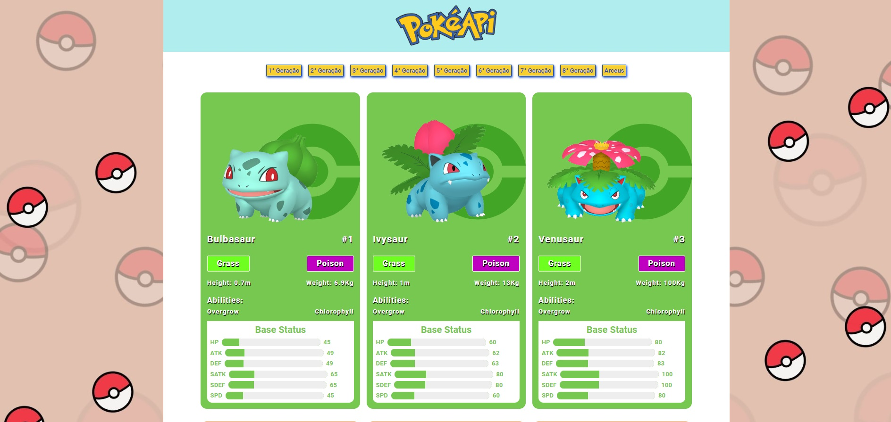

# 📌 **Formação JavaScript Developer**
## 🎯 **Construindo uma Pokédex com JavaScript**

Projeto de construção de uma pokedex utilizando HTML/CSS e javascript consumindo informações de uma API externa.

 

## 📎 **Sumário**
- ⭐ Features
- 📂 Temas abordados
- 🏆 Desafio
- 💻 Demonstração
- 🙋🏻‍♂️ Autor

 

## ⭐ **Features**
- Adição de HTML de forma dinâmica via JavaScript
- Consumo de API externo
- Utilização da Função fetch
- Utilização de Promisse
- Utilização de recusrsos modernos do ES6
- Estilização com CSS e grid-layouts
- Mobile First

 

## 📂 **Temas abordados**
- Requisições HTTP
- Consumo de API
- Utilização de Funções JavaScript
- Responsividade com Mobile First
- Estilização básica CSS

 

## 🏆 **Desafio**

Projeto tem como desafio aplicar os conceitos aprendidos nas aulas do módulo de JavaScript, assim como aplicar conceitos de requisição a uma API externa, utilização da função MAP, manipulação de resultados através de uma promise.

 

## 💻 **Demonstração**
<h3>Você pode acessar o resultado final do projeto<a href="https://brunooliveira16.github.io/Formacao-JavaScript-Developer-DIO/TRILHA-JAVASCRIPT-MODULO-02/DESAFIO-DE-PROJETO/index.html" target="_blank"> Clicando aqui</a></h3>

 

## 🙋🏻‍♂️ **Autor**
<h3>Bruno Oliveira - Software Developer</h3>

