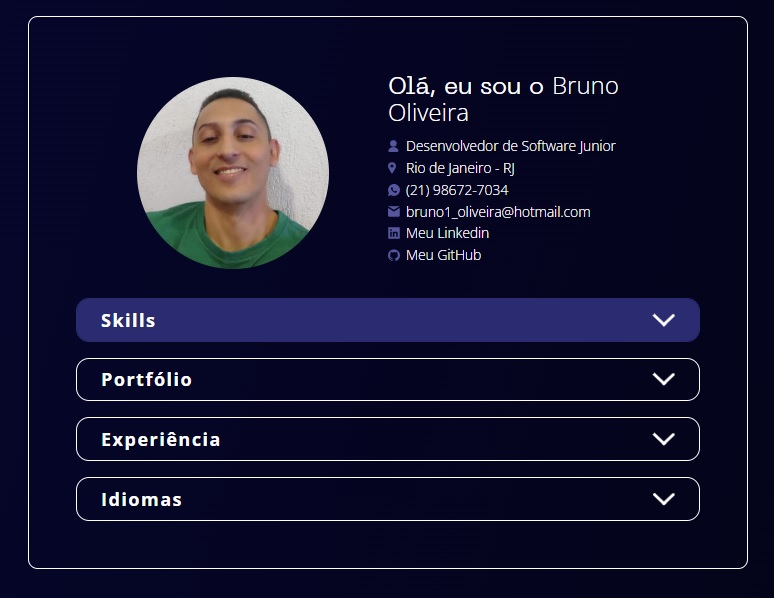
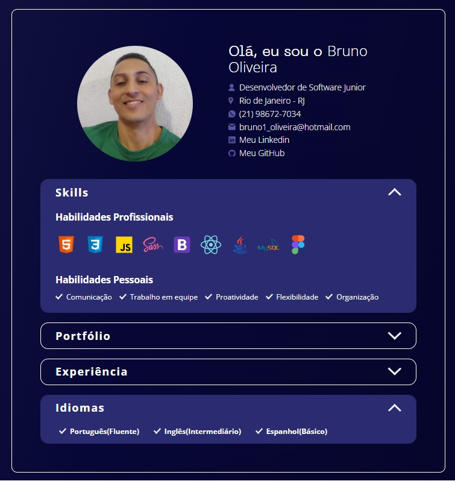

# 📌 **Portfólio Profissional**

O projeto de criação de um portfólio profissional, com o intuito de apresentar informações de contato, habilidades, projetos, experiência profissional, educação e idiomas.

 

## 📎 **Sumário**
- ⭐ Features
- 📂 Temas abordados
- 🏆 Desafio
- 💻 Demonstração
- 🙋🏻‍♂️ Autor

 

## ⭐ **Features**
- Menu acordeon para exibição das infromações
- Interação com os elementos do projeto e links
- UI Responsiva
- Consumo de dados via arquivo Json
- Utilização de APi Fetch
- Mobile First

 

## 📂 **Temas abordados**
Recursos presentes no projeto
- Fundamentos do CSS
- Flexbox
- Responsividade
- Pseudo-elementos
- Transições e animações
- consumo de API
- AsyncFunction
- Consumo de dados via Json
- Mobile First

 

## 🏆 **Desafio**
Aplicar conceitos aprendidos de CSS, JavaScript e consumo de API, utilizando, transições, animações, mobile first, função Async, fetch e consumo de dados json.

 

## 💻 **Demonstração**
Você pode acessar ao resultado final do projeto <a href="https://brunooliveira16.github.io/Formacao-JavaScript-Web-Developer-DIO/TRILHA-JAVASCRIPT-MODULO-04/index.html"><b>Clicando aqui.</b></a>

 

## 🙋🏻‍♂️ **Autor**
Bruno Oliveira